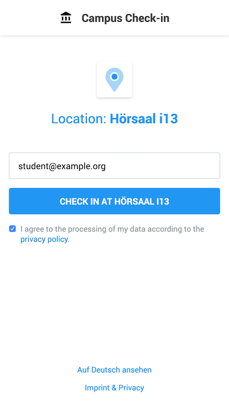
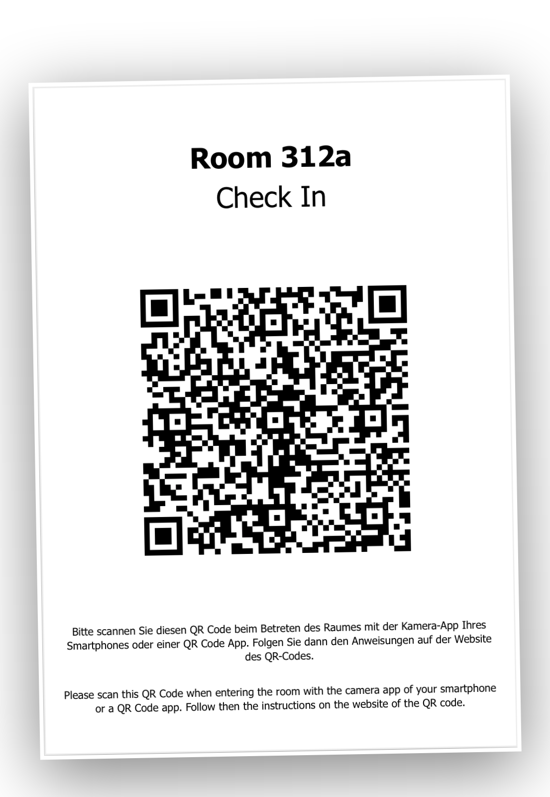
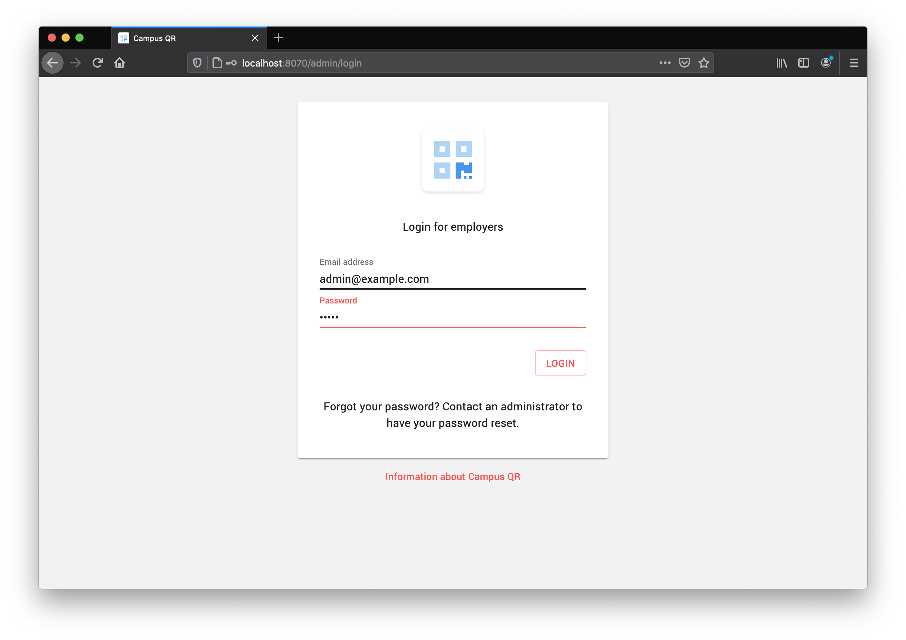
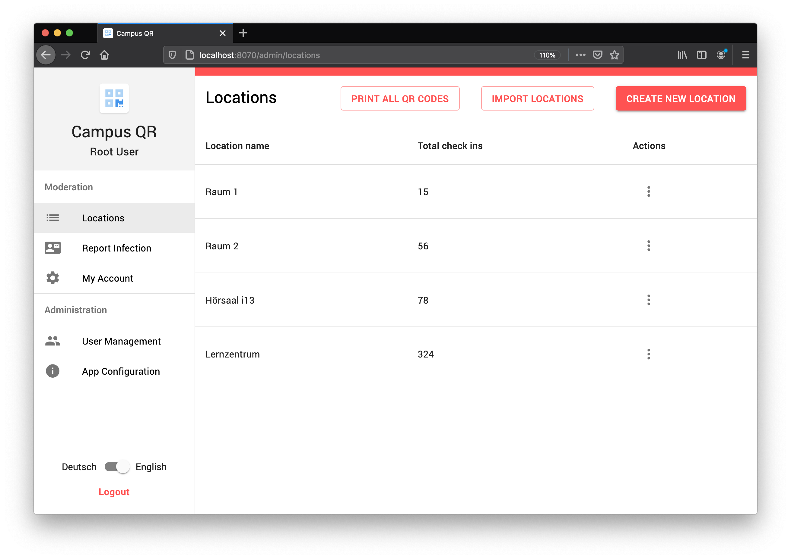
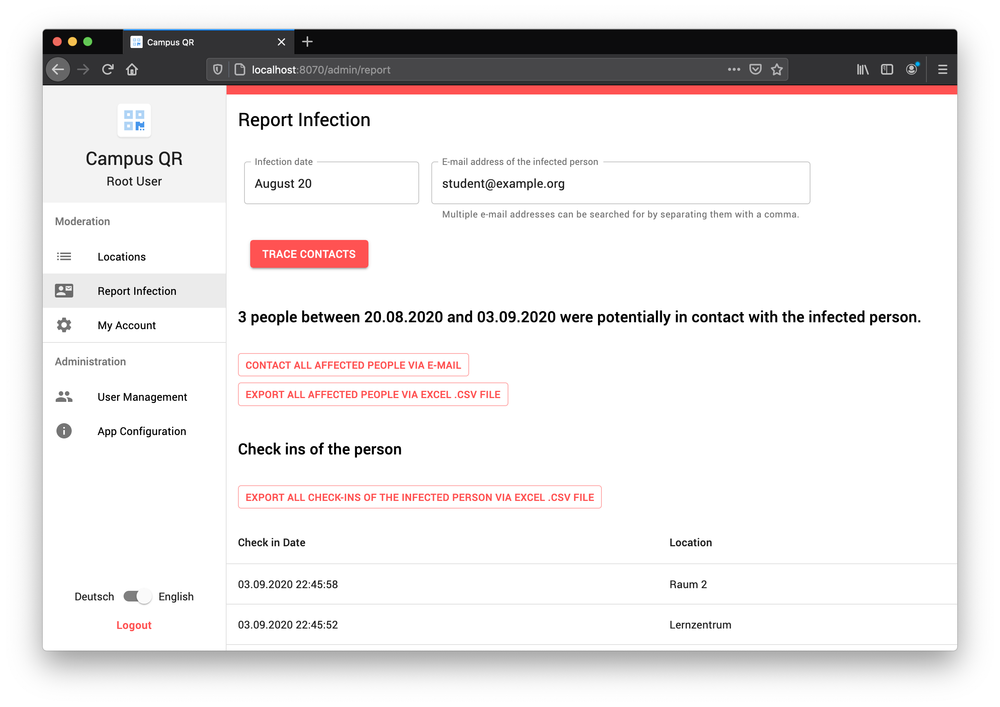

# Campus QR
Due to the current situation around the COVID-19 pandemic, Studo developed an open source system for contact tracing at universities.
When entering a lecture hall or seminar room, students and teachers can scan a QR code attached to the door or in the entrance area.
Campus QR allows creation and management of those QR codes.
An optimal implementation in terms of data protection and security are goals of this project.

Campus QR can additionally be used as access management system: Access to locations like department buildings is only granted by explicit invite.
Users scan the QR code attached to the entrance.
If access is granted, a unique animation with access information is shown at the users mobile device to allow entrance by a doorman or web-hook based door unlocking systems.
Access control or successful check-ins can also be verified by an employee during a lecutre in bulk, so lecturers can validate within seconds if hundreds of students have successfully checked in.

The system is open source and can be hosted by the university itself.
The web app is available as stand-alone application.
The [Studo app](https://studo.com) integrates the provided Android and iOS reference implementation to allow offline dispatching of check-in events.

## Features
* **Simple**: Both check-in and administration have a clean and easy to use user interface.
* **Secure**: State-of-the-art security measurements, role-based user management with only hashed password saving and encryption.
* **Accessible**: Mobile optimized and responsive check in and management UI on all major devices and browsers without installation.
* **Open source**: 100% of the code is open source and is without further modification production ready.
* **Self-hostable**: The whole application can be hosted by the university itself. [Studo](https://studo.com) provides support in hosting the application.
* **Managed hosting**: Secure and GDPR-compliant hosting in the EU with encrypted-at-rest databases by [Studo](https://studo.com) to go into production within days.
* **Multiple languages**: All elements of the app are localized to English and German to be inclusive of all students, employees and guests of a university.
* **Fully configurable**: Names, logos, links, privacy policy and text content is configurable in production without changing the source code.
* **Exportable**: Check-ins at specific locations and check-ins from specific people can be downloaded as csv file to open them in Excel.
* **Infection tracing**: Fast and reliable tracing of infection chains. 
* **Automatic data deletion**: After a configurable time (default: 4 weeks) the check-in data will be automatically deleted to comply with the GDPR.
* **Multirole administration**: The moderation frontend of Campus QR can be used by thousands of employees of a university.
* **Access management**: Creation of specific access for students or guests within selected time frame to allow a controlled reopening of university buildings.
* **Visitor list export**: Simple doorman specific interface with upcoming access permits
* **Scalable access verification**: Access control can be verified by one doorman or lecturer in parallel to avoid crowds around entries.
* **External identity management**: SSO, LDAP (using JNDI) and OAuth2 are supported by Ktor authentication packages. 

## Managed hosting features
Campus QR can be hosted by the university itself or by [Studo](https://studo.com). When hosted by Studo, the following hosting features are available per default: 
* **Horizontal application scaling**: By running several API nodes in parallel, the application infrastructure can be scaled to as many nodes as required.
* **Zero-downtime operations**: Deployment, container restarts and upgrades are zero-downtime operations: New containers have to be available at first before stopping the old containers.
* **Automatic security updates**: Containers apply OS and JVM security updates with zero downtime.
* **Real time metrics and logs**: Application nodes and database nodes allow easy monitoring and auditing.
* **Scalable database infrastructure**: The MongoDB database runs in high availability mode (replicaset) with 2 active data nodes, 1 backup node and 1 arbiter to ensure zero downtime (99.96% uptime guaranteed by SLA).
* **Dockerized database containers**: Database servers are dedicated processes sealed in docker containers. It allows seamless database upgrades with zero downtime if more space or memory is required.
* **Database backups**: Daily automated encrypted backups with retention policies to auto-delete old backups.
* **Database security**: SSL connections and Encryption-at-Rest are enabled per default.
* **Optimal database performance**: SSD-like performance on SAN-backed dedicated MongoDB processes.
* **Dedicated expect care and support**: Your application will be manged by an expert team that handles an infrastructure with more than 10.000 requests per minute.
* **GDPR compliant**: Hosted in the EU on ISO/IEC 27001:2013 certified datacenter infrastructure.

# Screenshots
## User Frontend
Students and teachers scan a printed QR code and check in with their e-mail address.
 

## Moderation Frontend
Employees of a university can login, create locations, report infections to notify affected people and manage users.

# Self hosting
## Setup
The following environment variables need to be configured:
* `PORT` (default: `8070`): Port where the web application will listen to
* `HOST` (default: `0.0.0.0`): By default the web application is accessible from every host. Set it to `127.0.0.1` if the web application should only be accessible from localhost.
* `MONGO_URI` (default: `mongodb://localhost:27017/campus-qr)`: Database URI to store further configuration, locations, check-ins and moderation users. Make sure that the database is either not accessible from another host or provide authentication parameters in the URI.

Start the application by `./gradlew run` or build the application with `.gradlew stage` to run it with `java -jar build/libs/Server.jar`.
The default admin email address is `admin@example.org` with password `admin`. Please change it immediately after your first login to the moderation frontend.

## Deployment
### Deployment on generic PaaS with Procfile
This repository provides a generic `Procfile` for easy deployment to most **PaaS** providers like [Scalingo](https://scalingo.com). 

Calling the `stage` gradle task (`./gradlew stage`) will build a *fat jar* in `build/libs/Server.jar`. This jar file already contains the **moderation frontend**. If your **PaaS** provider calls a different build task, inject the `stage` task as dependency there.

The server assumes that the PaaS provider provides all necessary environment variables mentioned in the [Setup](#Setup) section.

### Deployment on self-hosted hardware with Docker
Adjust the provided sample **Dockerfile** and define all necessary environment variables mentioned in the [Setup](#Setup) section.

# Project structure
This Git repository is a Kotlin Multiplatform Project using Gradle. Opening the project in IntelliJ works out of the box.

## Server
For the backend the project uses [Kotlin for Server-side Development](https://kotlinlang.org/docs/reference/server-overview.html) by running on the JVM. Supported JVM versions are JVM 8 LTS, JVM 11 LTS and the latest JVM version. This backend code is located in the subfolder *src/serverMain* and uses shared code from *src/commonMain*.

## User Frontend
The user frontend allows checking in with a QR code. This module is HTML5 based, the mobile optimized HTML5 is generated by the server. The user frontend communicates via HTTPS request with the server.

## Moderation Frontend
The moderation frontend allows creation of new QR codes, QR code management and user notifications. This module is a React project using [Kotlin/JS](https://kotlinlang.org/docs/reference/js-overview.html) to generate the JavaScript code that runs in a web browser. The moderation frontend communicates via HTTPS API calls with the server. The moderation frontend code is located in the subfolder *src/moderatorFrontendMain* and uses shared code from *src/commonMain*.

## Android reference implementation
The native Android reference implementation to scan QR codes is provided in the subfolder *campus-qr-android* and might be used by Android applications to allow scanning the QR codes while being offline and dispatching the check-in event when being online again.

## iOS reference implementation
The native iOS reference implementation to scan QR codes is provided in the subfolder *campus-qr-ios* and might be used by iOS applications to allow scanning the QR codes while being offline and dispatching the check-in event when being online again.

## Code Style Guide
The project follows the official [Kotlin Coding Conventions](https://kotlinlang.org/docs/reference/coding-conventions.html) with two additions: Line wrap is 140 characters, and indentation is 2 instead of 4 spaces (continuation indent is 4 instead of 8 spaces) on all file types. Please follow these conventions when creating a pull request.
